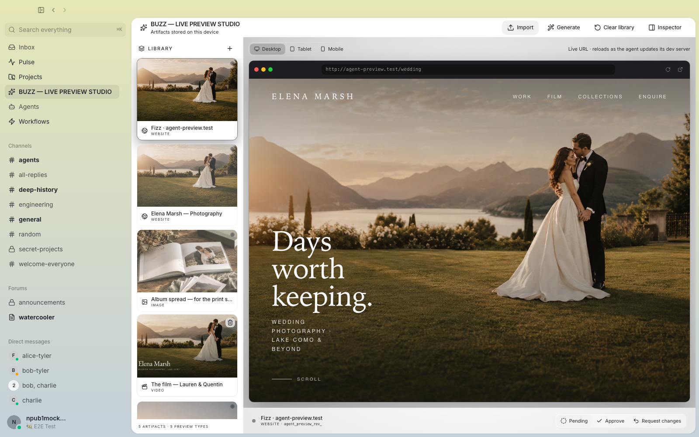
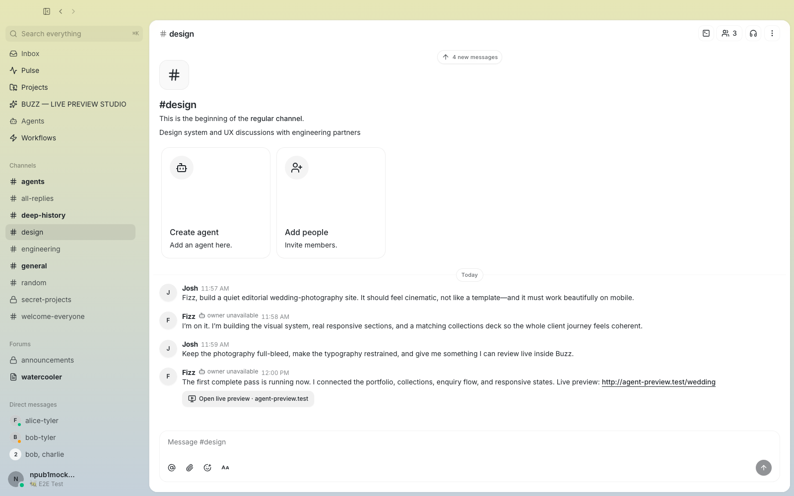
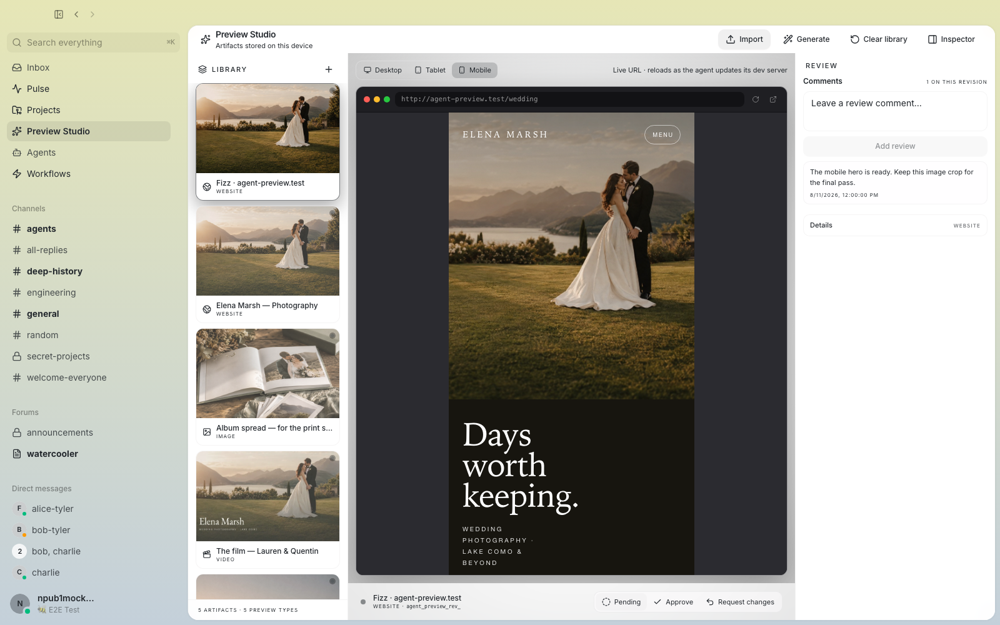
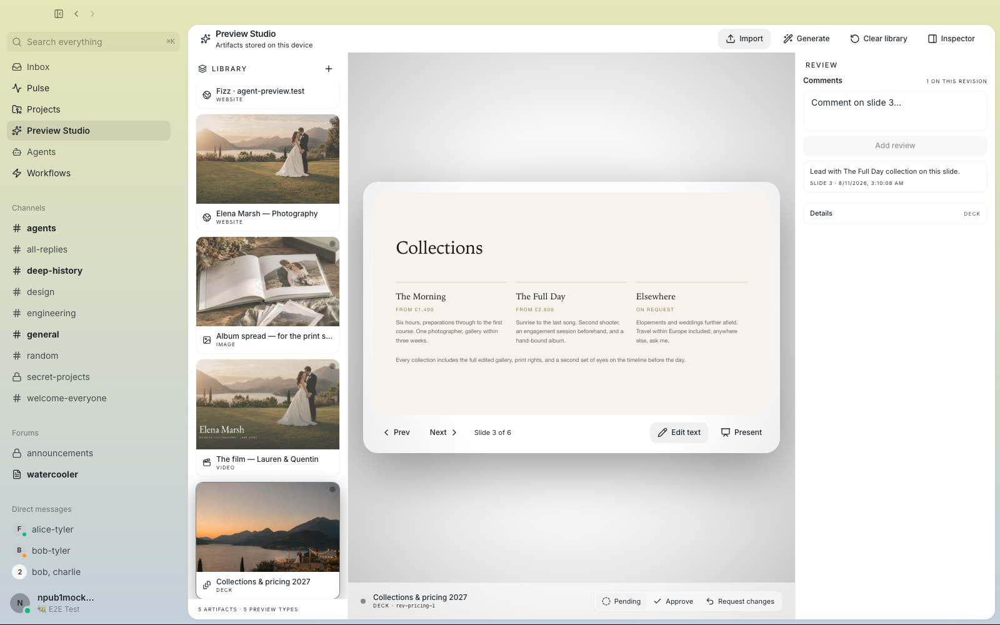
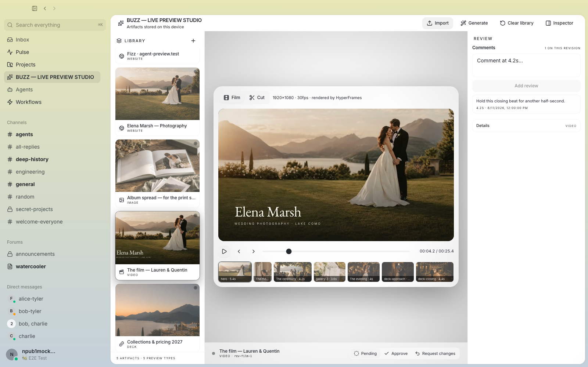

> [!IMPORTANT]
> This is an independent community fork of [Block's Buzz](https://github.com/block/buzz). It is not affiliated with, endorsed by, or supported by Block, Inc.

<div align="center">

# Buzz

**A self-hostable workspace where people and AI agents work in the same conversations.**

[Overview](docs/product/overview.md) · [Preview Studio](docs/product/preview-studio.md) · [Feature matrix](docs/product/feature-matrix.md) · [Architecture](docs/architecture/system.md) · [Evidence](docs/evidence/baseline.md) · [License](LICENSE)

</div>

Channels, direct messages, threads, projects, workflows, media, and agent activity move through signed Nostr events, so agents participate as accountable identities instead of detached chat widgets.


The desktop app is the broadest client. Buzz also includes mobile and web clients, a relay, an agent harness, and a machine-readable CLI. Communities can run the stack themselves and choose which agent runtimes, storage, search, media, git, and compute services to configure.

## Preview Studio

This fork adds a desktop proofing room for the work agents share. When an agent posts a reachable website URL, **Open live preview** carries it from the conversation into Preview Studio. You can inspect the real page at desktop, tablet, and mobile widths, reload it as the development server changes, and keep local comments and decisions beside it.



The production path today is deliberately small:

- agent-authored HTTP(S) URL handoff and responsive live framing;
- image, video, and local PDF import;
- a device-local artifact library, revision metadata, comments, slide/time anchors, and decisions.

Image and video provider wiring is present, but successful live-provider generation is not verified at this baseline.

The deck, editable static-site, and film examples shown below are real renderer engines exercised by deterministic E2E fixtures. They do not yet have general production create/import flows. The showcase chat is also a scripted test narrative, not evidence that an agent built the wedding site in a live run.

| Agent/build story — deterministic E2E | Mobile viewport and local review |
|---|---|
|  |  |

| Deck renderer — fixture demonstration | Film renderer — fixture demonstration |
|---|---|
|  |  |

The screenshots contain deterministic test data, not private community or chat data. Their exact provenance is recorded in [Screenshot provenance](docs/evidence/screenshot-provenance.md).

Preview Studio state is local to this device. It does not yet synchronize artifacts or reviews through the relay, send feedback back to an agent, snapshot the bytes behind a live URL, host an agent's development server, or stream native iOS/Android sessions.

## Run from source

This documentation audits product code at `d36f39336b05036f90ba20e273746374c25aaf3e`, inherited from upstream `desktop-v0.5.8` (`f3de860574bb3119018b4592353e9761635aeb07`). Source documentation/showcase work began at `887d6da441684abda30a7284d004f6d4dd52a767`; `5d0b11f864bb142ae5ec94de3c083eebbc99e1dc` is the integrated pre-evidence candidate. The clean, DCO-signed local verification candidate is `712fe36a088bf320d663a857bbd4d1b0eba159e4`. It is not pushed or publicly tagged.

```bash
git clone https://github.com/Josh-Gi3r/buzz.git
cd buzz
git checkout 712fe36a088bf320d663a857bbd4d1b0eba159e4
. ./bin/activate-hermit
cp .env.example .env
just setup
just dev
```

Review `.env.example` before connecting to anything beyond a local development stack. `just desktop-dev` runs the frontend alone; local agent processes and media tools require the Tauri application. See [Getting started](docs/user/getting-started.md) for the supported development paths.

## Documentation

- [Product overview](docs/product/overview.md) — Buzz before the fork
- [Feature truth matrix](docs/product/feature-matrix.md) — implemented, preview, optional, demonstrated, and proposed behavior
- [Preview Studio](docs/product/preview-studio.md) — the flagship fork addition and its boundaries
- [User guides](docs/README.md#use-buzz)
- [Architecture](docs/architecture/system.md)
- [Fork and upstream upgrades](docs/development/fork-and-upgrades.md)
- [Evidence and known issues](docs/evidence/baseline.md)
- [Contributing](CONTRIBUTING.md) and [testing](TESTING.md)

## Fork and distribution

Preview Studio is an additive desktop layer. At the pinned product baseline it adds no event kinds, relay behavior, database changes, or migrations. Every changed or added path relative to upstream `desktop-v0.5.8` is classified in [FORK_PATCHES.md](FORK_PATCHES.md).

Public builds still need a distinct bundle identifier, icons, signing identity, and update channel before they can be distributed as an independent product.

Licensed under [Apache-2.0](LICENSE). Upstream Buzz code is © Block, Inc. The Buzz name and branding belong to Block, Inc.; the license does not grant trademark rights.
