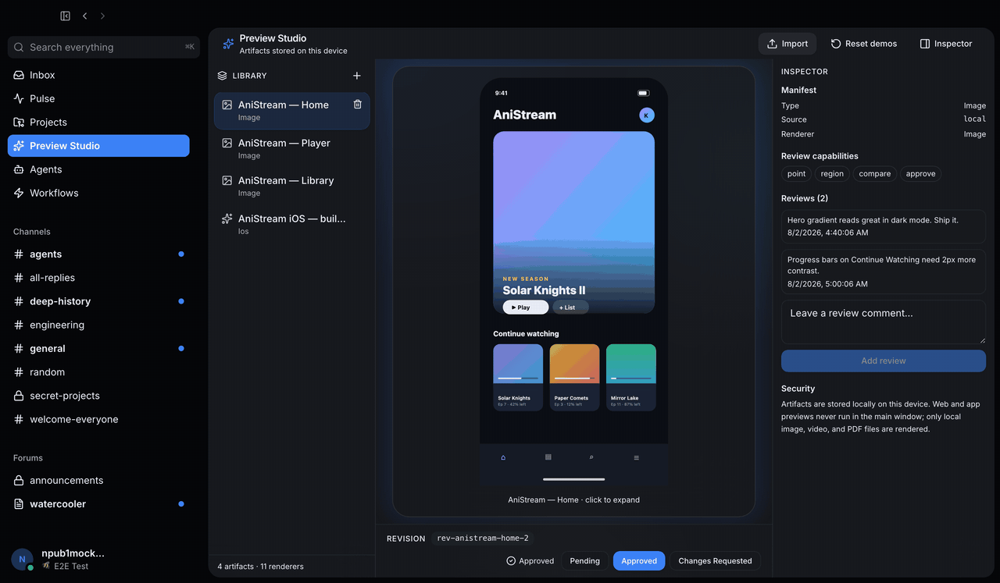

> **This is an independent community fork of [block/buzz](https://github.com/block/buzz).**
> It adds Preview Studio (an experimental artifact preview & review workspace) and the Studio
> visual system on top of upstream Buzz. It is not affiliated with, endorsed by, or supported
> by Block, Inc. The official Buzz app and releases live upstream. Every modification to an
> upstream-owned file is tracked in [FORK_PATCHES.md](FORK_PATCHES.md).

# Buzz Preview Studio

An experimental artifact preview & review workspace built on [block/buzz](https://github.com/block/buzz).


## What is this?

Buzz is a self-hostable workspace where humans and AI agents share the same rooms, backed by
a Nostr relay that treats every message, review, and workflow step as a signed event. This
fork adds Preview Studio: a feature-flagged workspace inside the Buzz desktop app for
collecting media artifacts (images, video, PDFs), previewing them on a dedicated stage, and
attaching review comments and approve/request-changes decisions. It also introduces the Studio visual layer, a
set of material CSS tokens that give the Studio screen its own visual identity without
touching the rest of the app.

## Relationship to upstream

This fork follows an **additive-only** policy:

- New functionality lives in new files and directories (`desktop/src/features/preview-studio/`,
  `desktop/src/shared/theme/studio/`, `docs/spec/`, `docs/design/`).
- The small set of upstream-owned files this fork touches — route registration, sidebar
  wiring, the feature manifest — is listed with rationale in [FORK_PATCHES.md](FORK_PATCHES.md).
- Upstream `main` is merged in periodically through a tested merge lane; published fork
  history is never rewritten.
- The fork is built on upstream commit `19d57b0`.

## Features today

Preview Studio is off by default and fully local. When enabled it provides:

- A **Preview Studio** sidebar entry and `/preview-studio` route (flag-gated; the app is
  unchanged when the flag is off).
- A **local artifact library** persisted in browser `localStorage`
  (key `buzz.previewStudio.library.v1`). Nothing is published to the relay.
- **Import** of image, video, and PDF files from disk. Files under ~2.5 MB persist across
  reloads as data URLs; larger files use session object URLs and must be re-imported after
  a reload.
- An **image stage** with click-to-expand lightbox.
- A **video stage** that reuses Buzz's existing `VideoPlayer`.
- An **inline PDF preview** rendered in a sandboxed frame restricted to local
  `data:`/`blob:` sources — remote URLs are never framed.
- **Review comments** on the selected revision. The review model carries optional video time
  anchors, which are displayed when present.
- **Decisions** per revision: pending, approved, or changes requested.
- A **renderer registry** mapping artifact types to display capabilities and fallback cards.
- **Demo seed artifacts** on first run, with a one-click reset.
- **Studio CSS tokens** scoped to the Studio screen.

### Not yet

The following are designed but not implemented:

- Relay event kinds for artifacts (proposal in
  [docs/spec/artifact-kinds-v0.md](docs/spec/artifact-kinds-v0.md) — collision-audited but
  not registered; nothing is published to any relay).
- Multi-user review sync.
- Sandboxed previews for web apps and native app builds.
- Deck/slide conversion.
- The Studio visual layer applied to the global app shell (Studio is Studio-scoped).

## See it in action



## Quickstart

You'll need [Docker](https://docs.docker.com/get-docker/) and
[Hermit](https://cashapp.github.io/hermit/) (or Rust 1.88+, Node 24+, pnpm 10+, `just`).

```bash
. ./bin/activate-hermit   # pinned toolchain
cp .env.example .env      # local configuration
just setup                # deps, Docker services, migrations
just desktop-dev          # web-only dev server (fast iteration)
# or
just dev                  # full Tauri desktop app + relay
```

To run an isolated sandbox instance that never shares state with a production Buzz install
(separate bundle ID, app-data directory, keyring, and nest):

```bash
./scripts/run-studio-sandbox.sh
```

### Enable Preview Studio

1. Open **Settings**.
2. Find the **Experiments** card.
3. Enable **Preview Studio**.
4. A **Preview Studio** entry appears in the sidebar.

The flag is off by default. With the flag off, the app behaves exactly like upstream Buzz.

## Architecture & specs

- [docs/design/architecture.md](docs/design/architecture.md) — product model, event model,
  security boundary, and the upstream-safe fork strategy.
- [docs/design/](docs/design/) — design principles and decision records.
- [docs/spec/](docs/spec/) — artifact manifest, review anchor, and event kind specifications.
- [docs/preview-studio/user-guide.md](docs/preview-studio/user-guide.md) — using the Studio.

## Roadmap

- Relay event kinds for artifact pointers, revisions, reviews, and decisions, per
  [docs/spec/artifact-kinds-v0.md](docs/spec/artifact-kinds-v0.md).
- Multi-user review sync over the relay, gated on a `preview_artifacts_v1` capability
  advertisement.
- Sandboxed preview sessions for static web builds and native app builds, isolated from the
  privileged main renderer.
- Studio as an opt-in visual profile for the whole shell.
- A distribution identity of the fork's own (app ID, icons, update channel) separate from
  upstream Buzz.

## Contributing

- **Generic fixes belong upstream first.** If your change makes sense for stock Buzz, open it
  against [block/buzz](https://github.com/block/buzz) — this fork picks it up on the next
  merge.
- Fork-specific changes must follow the additive-only policy: new files and directories where
  possible, and any edit to an upstream-owned file recorded in
  [FORK_PATCHES.md](FORK_PATCHES.md).
- Upstream's [CONTRIBUTING.md](CONTRIBUTING.md) covers setup, code style, and the PR process;
  it applies here too.

## License & trademarks

This repository is licensed under [Apache-2.0](LICENSE). The upstream Buzz codebase is
© Block, Inc. The "Buzz" name and branding belong to Block, Inc.; the Apache license does not
grant trademark rights. The name "Buzz Preview Studio" is used only to identify this as a
fork of the Buzz project — this is an independent community project, not endorsed by Block,
and no builds are distributed under Block's identifiers.

Please do not report bugs in unmodified upstream code here — file those at
[block/buzz issues](https://github.com/block/buzz/issues). This repository's tracker is for
Preview Studio and the Studio visual layer only.
